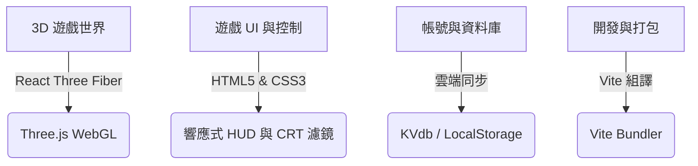

# 🛠️ DELTA FORCE: 3D 戰術訓練基地 - 運用技術報告

這款遊戲是一款基於現代 Web 技術開發的 **3D 第一人稱戰術射擊網頁遊戲**。它融合了 3D 圖形渲染、響應式前端介面與雲端資料庫同步。以下為核心技術與運用細節的解析：

---

## 核心技術四大板塊

| 技術板塊 | 所使用的技術與工具 | 說明 (在遊戲中扮演的角色) |
| :--- | :--- | :--- |
| **1. 3D 畫面與世界** | **Three.js** + **React Three Fiber (R3F)** | 負責繪製 3D 槍枝模型、敵人、地面、子彈飛過的光軌，以及控制玩家的第一人稱視角（Camera）。 |
| **2. 介面與控制 (HUD)** | **HTML5** + **Vanilla CSS** | 繪製血條、小地圖雷達、暫停選單、個人倉庫（Stash）拖曳界面、黑市商店，以及手機端的虛擬方向搖桿與開火按鍵。 |
| **3. 資料儲存與同步** | **LocalStorage** + **KVdb (雲端鍵值庫)** | 當您關閉網頁時，進度不會消失；當您連網時，能將戰績同步到全球排行榜。 |
| **4. 開發打包工具** | **Vite** + **ESLint** | 負責把 React 代碼、3D 資源、CSS 樣式快速打包壓縮成瀏覽器看得懂的網頁檔案。 |

---

## 技術細節與運作原理

### 💡 1. 3D 視覺渲染
網頁原本是二維（2D）的。為了在瀏覽器裡畫出 3D 世界，遊戲使用了 **WebGL** 技術，並透過 **Three.js** 與 **React Three Fiber (R3F)** 來簡化代碼：
*   **3D 模型與幾何體**：遊戲中的槍枝、彈殼、敵人身體都是由 3D 頂點與三角面組成的網格（Mesh）。
*   **光影與材質**：利用網頁渲染器的光源（例如環境光 AmbientLight、平行光 DirectionalLight）照亮場景，並使用金屬感或半透明材質，讓武器與防具看起來更逼真。
*   **粒子系統 (Particle Systems)**：當您開槍時，槍口會冒出火花，子彈打到牆壁會產生碎屑，這些都是由成百上千個微小粒子組成的動態效果。

### 📱 2. 手機與電腦的畫面和操作適配
為了讓遊戲既能在電腦用滑鼠鍵盤玩，又能在手機用手指滑動玩：
*   **指針鎖定 (Pointer Lock API)**：在電腦上，點擊「開始」後滑鼠指針會被隱藏並鎖定在螢幕中央，移動滑鼠就能直接轉動視角。
*   **虛擬搖桿與觸控監聽**：在手機上，程式會監聽 `touchstart` (手指碰到) 和 `touchmove` (手指滑動) 事件，計算手指移動的距離來轉換為腳步移動或轉向速度。
*   **CSS 媒體查詢 (@media)**：根據螢幕寬高，自動縮小背包與狀態卡片，並把按鍵移到雙指最容易按到的安全區域（如避開手機底部的系統手勢條）。

### 💾 3. 數據儲存與雲端同步
遊戲內有豐富的倉庫系統，它結合了兩種儲存技術：
*   **本機快取 (LocalStorage)**：這是瀏覽器內建的迷你資料庫，儲存您的密碼、金幣與槍枝數量。
*   **雲端同步 (RESTful API)**：遊戲設定了與 **KVdb.io** 雲端資料庫的連接。當您完成一場戰鬥或修改暱稱時，程式會自動發送 HTTP POST 請求，把帳號的最新狀態同步到雲端，這樣您換一台電腦或用手機登入時，資料依舊存在。

### 🎯 4. 射擊與受傷的判定邏輯
*   **射線投射 (Raycasting)**：當您按下開火鍵，程式會從相機正中央發射一條無形的「3D 射線」，計算這條射線是否穿過敵人的 3D 碰撞盒（Bounding Box）。如果碰到了，就判定為擊中；如果碰到了頭部位置的盒子，則判定為爆頭（Headshot）。
*   **AABB 碰撞盒**：用於防止玩家穿牆，限制玩家在地圖邊界內移動。

### 🌀 5. 空間扭曲與交戰區 AI 演算法
為了在地下通道地圖中實作「空間扭曲」與「特種部隊交戰」兩大特殊事件，引進了以下底層演算法：
*   **非線性空間投影與座標變形 (Space Warp Geometry)**：
    地鐵長廊的原始 3D 幾何是直線的。為了實現長廊彎曲，我們實作了**輕量級的 3D 座標非線性投影函式 `getWarpPosAndRot`**：
    $$x_c = \sin(z \times 0.04) \times 6.0$$
    所有長廊的靜態組件（分段地面、牆面、天花板）、動態裝飾物（自動販賣機、垃圾桶、指示牌）以及玩家與敵人的碰撞體 `activeColliders`，皆會依據其 $z$ 軸位置，計算出中心點偏移量 $x_c$ 與正切旋轉角 $\theta_y = \arctan(0.24 \cos(z \times 0.04))$，動態重組其 3D 矩陣。
*   **動態碰撞盒變形與滑動檢測**：
    在 `PlayerController` 和敵軍 AI 移動的 AABB 檢測中，所有的碰撞體均在每一幀依據扭曲公式映射至新的 $X/Z$ 座標，確保玩家與敵軍在正弦波通道內移動時能獲得完美的滑動阻擋效果，不產生穿牆或浮空。
*   **交戰區域多目標決策樹 (Multi-target AI Arbitration)**：
    友軍（DELTA 特種部隊）與敵軍 AI 使用了基於距離與陣營的動態目標鎖定演算法：
    *   **友軍 AI**：遍歷全場，動態尋找並鎖定距離自身最近的「存活敵方 AI」。
    *   **敵方 AI**：比較玩家位置與所有存活「友軍 AI」位置，挑選距離最近者作為攻擊目標，實施包抄、射擊、或投擲手榴彈。
    *   **射擊傷害派發與友軍保護**：在射擊射線投射判定（Raycasting）中，若射線最先相交的是「友軍」，玩家射擊會被判定為無效（不觸發 Hitmarker 且不扣血，發射火星微粒）；而敵我雙方的 AI 相互射擊時，則會呼叫 `handleShootEnemy` 計算傷害與擊殺日誌。
