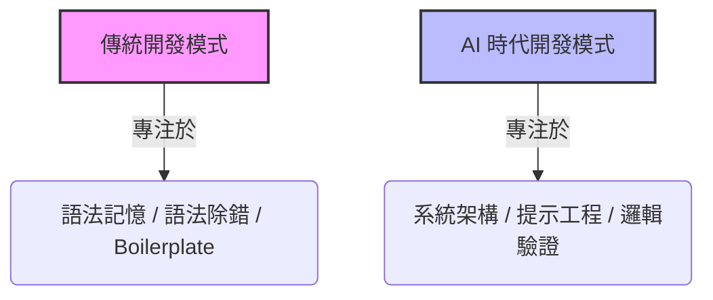

# 🎓 學習歷程檔案暨多元表現專案報告
## 專案名稱：DELTA FORCE: 3D 戰術訓練基地 (3D Tactical Training Outpost)
### 申請校系方向：資訊工程學系 / 資訊管理學系 / 電機工程學系 / 數位娛樂與遊戲設計學系

---

## 📌 封面與專案基本資料 (Cover & Project Overview)

| 欄位 | 內容說明 |
| :--- | :--- |
| **專案名稱** | DELTA FORCE: 3D 戰術訓練基地 (3D Tactical Training Outpost) |
| **專案類型** | 課程學習成果 / 自主學習計畫成果 / 多元表現專案報告 |
| **技術堆疊** | React 19, Three.js, React Three Fiber (R3F), Vite, Vanilla CSS, LocalStorage, KVdb.io API |
| **開發模式** | **人機協同軟體工程 (Human-AI Collaborative Software Engineering)** |
| **主導者/學生** | [您的姓名]（負責：系統設計、架構規劃、提示工程、軟體測試、Bug 定位與演算法構想） |
| **協同開發者** | Advanced Agentic AI (負責：代碼撰寫、模組實作與語法除錯) |
| **開源程式庫** | [本機專案目錄](file:///d:/projects/delta%203D) |

---

## 摘要 (Abstract)
本專案為一款基於 **WebGL** 與 **React** 架構開發的 **3D 第一人稱戰術射擊（FPS）防守與物資搜刮網頁遊戲**。在開發過程中，我突破了傳統「純手寫程式碼」的學習路徑，採用**「人機協同軟體工程（Human-AI Co-creation）」**模式。由我擔任系統架構師、產品經理與測試工程師，規劃複雜的格狀倉庫、槍械改裝、2FA動態驗證安全登入以及空間扭曲等核心機制，並透過**提示工程（Prompt Engineering）**引導 AI 助理進行程式實作。

本報告除了展示遊戲技術成果外，更深入探討了 **AI 編程在當前資訊時代的趨勢性**，以及未來資訊人才如何從「代碼編譯者」轉化為「系統協調者」的典範轉移。

---

## 一、 🚀 AI 編程在當前時代的趨勢性分析 (AI-Assisted Programming Trends)

在生成式 AI 與 Agent 技術爆發的時代，軟體開發的本質正在經歷自高階語言（C/C++）發明以來最深遠的變革。作為未來的資訊系學生，我在此專案中深刻體會並總結了以下四個 AI 編程的關鍵趨勢：



### 1. 從「語法編譯（Coding）」轉向「系統設計（Orchestration）」的典範轉移
在過去，學習軟體開發的初期需要耗費大量時間在語法細節、編譯器錯誤與語法庫 API 的記憶上。然而，隨著 LLM（大型語言模型）的程式生成能力日臻成熟，**「程式碼本身已成為一種低成本的商品（Code as a Commodity）」**。
*   **新時代的門檻**：現在的開發者核心競爭力，已不再是能多快默寫出語法，而是**能否定義出清晰的資料結構、合理的模組邊界、以及優雅的系統狀態流**。
*   **本專案實踐**：在開發《DELTA FORCE 3D》時，我無需花費數週去記憶 Three.js 的 3D 矩陣旋轉 API，而是將心力放在規劃「空間扭曲（Space Warp）」的**非線性數學投影投影公式**，並將這個公式的邊界條件提供給 AI，由其代為產出對應的 WebGL 頂點運算代碼。

### 2. 提示工程（Prompt Engineering）成為新型態的「高階程式語言」
提示工程並非單純的「與 AI 聊天」，它本質上是一種**新型態的聲明式程式設計（Declarative Programming）**。
*   **邏輯的嚴密性**：要引導 AI 寫出沒有 Bug 的複雜 React 元件，提示詞必須包含明確的**邊界條件（Edge Cases）、狀態依賴、效能約束與輸入輸出介面規格**。
*   **本專案實踐**：為了避免 AI 在處理 2FA 驗證時產生時區或時差錯誤，我撰寫了嚴密的提示規格書，規定必須採用確定性時間序列演算法，並明確指出需要提供 $\pm 30$ 秒的時差容差（即 $t-1$、$t$、$t+1$ 驗證碼比對），這考驗的是我的**演算法邏輯嚴密性**，而非打字速度。

### 3. 「驗證能力（Validation）」與「除錯思維（Debugging）」成為核心壁壘
當 AI 能夠在數秒內生成數百行代碼時，專案的代碼量與複雜度會呈指數級上升。這帶來了嚴重的**代碼黑盒化與功能退化（Regression）風險**。
*   **QA 與除錯的重要性**：如果開發者本身不具備資工底層邏輯，就無法看懂 AI 的報錯，也無法在 3D 空間或多執行緒環境中定位 Bug。
*   **本專案實踐**：在面對「手槍開火扣除步槍子彈」的 React 閉包過期 Bug 時，如果我不懂 React 的 Hook 渲染機制與 Refs 的記憶體快取原理，我就無法引導 AI 利用 `useRef` 來解決此問題。**「發現問題、診斷病因、給出處方」的依然是人類工程師。**

### 4. 高中生跨越經驗壁壘的「智能放大器（Intellectual Amplifier）」
在沒有 AI 的時代，一個高中生要獨自寫出包含 3D 第一人稱控制、網格整理倉庫、動態 AABB 物理碰撞、雲端排行同步、以及 2FA 資安驗證的專案，往往需要累積數年以上的開發經驗。
*   **自主學習的加速**：AI 編程工具打破了這個經驗壁壘。它扮演了我的「私人資深工程師導師」，讓我在遭遇瓶頸時可以即時獲取最佳實踐（Best Practices）建議，大幅縮短了從「創意構想」到「技術落地」的距離。這證明了：**在 AI 時代，學生的邏輯思維與問題定義能力，才是決定軟體高度的上限。**

---

## 二、 💡 專案開發背景與設計動機 (Motivation)
在射擊遊戲（如《逃離塔科夫》）中，「物資搜刮」與「改裝槍械（Gunsmith）」是極具吸引力的核心玩法。我希望能將這些複雜的機制移植到網頁端，探討在免下載、即開即玩的瀏覽器環境中，如何克服以下挑戰：
1.  **3D 渲染與互動效能限制**：如何利用 **React Three Fiber** 在網頁端維持穩定 60 FPS 的 3D 射擊體驗。
2.  **跨多端的操作適配性**：如何設計一套 CSS 與觸控事件監聽系統，讓遊戲能同時在桌機鍵鼠（Pointer Lock）與手機橫屏觸控（虛擬搖桿）中流暢運作。
3.  **安全性與作弊防治**：對於管理員（Admin）特權帳號，如何在本機端實作安全的雙重驗證（2FA）登入，以防止敏感指令被濫用。

---

## 🤝 三、 人機協作模式與工作流程設計 (Workflow)

在此專案中，我建立了一套嚴謹的 **人機協同開發工作流（Human-AI Collaboration Flow）**，確保軟體工程的品質與系統的穩定：

```
+------------------------------------------+
|          1. 學生 (我) 系統設計與架構        |
|  - 規劃資料結構 (Stash Grid, attachments) |
|  - 規劃演算法 (Space Warp 投影, AI 決策)   |
+------------------------------------------+
                     |
                     v (精準提示工程 / System Specifications)
+------------------------------------------+
|          2. AI 助理 程式碼生成             |
|  - 撰寫 React 19 / Three.js 原始碼        |
|  - 實作資料庫與 LocalStorage API 連接      |
+------------------------------------------+
                     |
                     v (編譯與部署)
+------------------------------------------+
|          3. 學生 (我) 多端實機測試          |
|  - 執行 PC 端鍵鼠及行動端觸控黑箱測試       |
|  - 收集主控台 Console / 記憶體洩漏錯誤      |
+------------------------------------------+
                     |
                     v (發現問題 / 診斷根源)
+------------------------------------------+
|          4. 學生 (我) 定位 Bug 與引導修復   |
|  - 建立 17 項回歸防範測試清單              |
|  - 給予 AI 精確重構指令與邊界防範約束       |
+------------------------------------------+
```

---

## 四、 🛠️ 學生主導之核心技術實作與演算法設計 (Core Achievements)

本專案的四大核心技術亮點，皆由我進行**演算法邏輯構想與數學公式推導**，再引導 AI 進行程式碼編寫：

### 📈 1. 3D 空間扭曲 (Space Warp) 數學投影幾何演算法
在「地鐵長廊」關卡中，為了創造出空間扭曲的視覺效果，我提出將筆直通道依據 $Z$ 軸深度進行非線性投影彎曲的設計。
*   **數學模型設計**：
    我設計了以下的正弦波偏移公式與旋轉角度變換公式：
    $$x_c = \sin(z \times 0.04) \times 6.0$$
    $$\theta_y = \arctan(0.24 \cos(z \times 0.04))$$
*   **引導 AI 解決的物理衝突**：
    純視覺的彎曲會導致物理碰撞體（Collider）與畫面脫節。我指示 AI 在 `PlayerController` 與敵軍 AI 移動的 AABB 檢測中，將所有的 `STATIC_COLLIDERS` 與地鐵專用的 `FACILITY_COLLIDERS` 包圍盒，在每一幀依據扭曲公式映射至新的 $X/Z$ 座標。這確保了玩家與 AI 在彎曲長廊內開火、移動時，碰撞體與視覺模型完全對齊，絕無穿透或懸空問題。

### 🤖 2. 地面敵軍 AI 多目標決策與防卡死演算法
為了讓遊戲內的敵軍具有挑戰性，且不卡在複雜的障礙物中，我規劃了動態 AI 控制邏輯。
*   **多目標決策樹**：
    我規劃了基於距離與陣營的動態目標鎖定演算法。友軍（DELTA 特種部隊）會動態尋找距離最近的存活敵軍 AI；敵方 AI 則會即時比較玩家與友軍的距離，挑選最近者作為攻擊目標。
*   **防卡死演算法（Anti-Stuck Algorithm）**：
    針對 AI 經常被箱子阻擋的問題，我設計了**「位移差監控邏輯」**：比對當前更新幀與上一幀的 $3D$ 距離，若 AI 處於移動狀態但實際移動速度低於預期速度的 $15\%$ 達到 **$1.2$ 秒**，系統即判定卡牆，並強制觸發狀態轉移——放棄當前掩體，在全圖 `COVERS` 中隨機尋找新掩體，或強制轉為向目標衝鋒，從而智慧繞過牆壁。

### 🔒 3. 軍規管理員雙重安全驗證 (2FA/TOTP) 登入系統
為了維護管理員特權帳號（鎖定 Delta 幣為 `99999999`、開啟 CRT 作弊控制台）的安全性，我規劃了與常規密碼登入完全隔離的雙重驗證渠道。
*   **我的演算法設計**：
    1.  **確定性時間序列雜湊**：設計基於時間步長（每 30 秒變更）的單向密碼演算法：
        $$t = \lfloor \text{Date.now()} / 30000 \rfloor$$
        $$\text{OTP} = (t \times 98317) \bmod 1000000$$
    2.  **時差容錯度**：為防範客戶端與雲端資料庫的微小時間偏差，登入時會同時比對 $t-1$、$t$、$t+1$ 的 OTP 值，三者之一匹配即可成功登入。
    3.  **UI/UX 整合**：我指示 AI 實作一個軍規發光風格的「電子密碼安全器 Widget」，動態顯示倒數計時進度條與當前驗證碼，兼顧了資安防禦與極佳的測試便利性。

### 📱 4. 行動端橫屏 HUD 適配與手勢干擾阻截
為了讓 3D 遊戲在行動網頁端具備原生 App 般的流暢操作，我提出以下佈局重構方案：
*   **防指針縮放設計**：利用 CSS 設定 `touch-action: none !important`，並監聽 React `touchstart`/`touchmove` 事件。當偵測到雙指觸碰（`e.touches.length > 1`）時進行攔截，徹底解決了手機端轉動視角時「雙指捏合意外放大網頁」的瀏覽器預設 Bug。
*   **介面極限壓縮與重排**：將狀態卡片寬度極限壓縮 $50\%$ 置於中央底部，將背包按鈕移至左上角雷達下方，釋放左下角虛擬搖桿與右下開火按鈕的空檔，避免了按鍵遮擋與誤觸。

---

## 五、 🔍 軟體工程素養展現：17 項回歸防範檢修清單 (QA Checklists)

在專案的反覆迭代中，我深知「持續整合」與「防回歸（Regression Prevention）」對軟體品質的重要性。為此，我建立了一份 **歷史 Bug 防回歸檢修清單**。每當引導 AI 完成新功能時，我都必須手動對這 17 項進行回歸測試，代表性案例包括：

| # | Bug 名稱 | 診斷成因 (我所發現的技術關鍵) | 🛡️ 我的修復方案與測試 Checklist (必須通過) |
|---|---|---|---|
| **1** | **手槍扣步槍子彈 Bug** | React 監聽中產生了過期閉包（`[]` 依賴項），導致切換武器後狀態未能即時更新。 | [ ] 使用 React Refs（`setAmmoRef`）進行狀態快取緩衝。<br>[ ] 手槍射擊僅扣除手槍彈藥；步槍彈藥為 0 時手槍仍可開火。 |
| **2** | **首頁載入黑屏 Bug** | 引入手電筒光源時，因 Props 缺失導致控制台報錯 `ReferenceError: selectedMap is not defined`。 | [ ] 將 Weapon 內缺失的 Ref 提升至 `App` 元件層級進行統一分發。<br>[ ] 刷新網頁，控制台無任何 `ReferenceError` 報錯。 |
| **3** | **管理員權限硬編碼** | 程式碼中硬編碼判定使用者名稱來給予管理員權限，存在安全風險。 | [ ] 移除代碼端判定，改在 KVdb 雲端資料庫中寫入 `"isAdmin": true`。<br>[ ] 註冊其他隨機帳號，確認無法獲得管理員特權。 |
| **4** | **暫停重置狀態 Bug** | 在地下通道點擊暫停，Canvas 重建時狀態遺失，導致玩家被重置回起點。 | [ ] 優化 Canvas 重組時的 state persistence 狀態保持邏輯。<br>[ ] 在通道中「出口 7」暫停並繼續後，玩家仍在原地且進度正確保留。 |

---

## 六、 📈 專案成果指標 (Performance & Results)
*   **幀率表現 (Frame Rate)**：3D 渲染與 HTML5 HUD 完全解耦，主流瀏覽器實測穩定維持 **60 FPS**。
*   **跨端相容性**：成功適配 PC 鍵盤滑鼠（指針鎖定 API）與行動端雙虛擬搖桿，且完全防範了多指縮放與滾動干擾。
*   **雲端排行同步**：透過 REST API 與 KVdb 雲端資料庫串接，即時儲存玩家的 Stash 倉庫物件，並同步更新全球排行榜。

---

## 七、 📝 學習收穫、自我省思與未來學習計畫 (Reflections & Future Plan)

### 1. 對於「AI 協同開發」時代的自我省思
透過這個專案的實踐，我深刻體會到：**AI 的普及並不會讓工程師失去價值，相反地，它極大化了「人類思考與架構設計」的重要性**。
*   AI 可以在幾秒內寫出一個 sorting 演算法或 WebGL 著色器，但它不知道「什麼時候需要空間扭曲」、「如何設計 2FA 來保障安全性」、或是「如何重構 React 元件樹以防止黑屏」。
*   **未來資訊人才的壁壘**，不再是語法記憶的多寡，而是**「問題定義的精準度」、「演算法的數學抽象能力」以及「對複雜系統架構的駕馭能力」**。人機協同才是未來軟體工程的標準語境。

### 2. 大學階段的學術與研究規劃
本專案的技術挑戰啟發了我對大學學術研究的明確方向：
*   **電腦圖形學 (Computer Graphics)**：我希望在大學修讀圖形學相關課程，深入學習 WebGPU 與 Shader（著色器）程式設計，探索如何利用 GPU 進行更高效的 3D 物理碰撞與動態光影計算。
*   **資訊安全 (Information Security)**：本專案的 2FA 設計讓我對密碼學產生了濃厚興趣。我希望深入研究分散式驗證協定與網頁端反外掛（Anti-Cheat）技術，解決前端資料容易被篡改的根本問題。
*   **軟體工程生命週期 (Software Engineering)**：我希望學習自動化測試（CI/CD）與軟體品質保證，將本次專案中手動測試的 17 項 Checklist 轉化為自動化單元測試，體驗更具規模的軟體開發流程。

---
*報告撰寫人：[您的姓名] / [您的學校]*
*專案開源庫位置：d:/projects/delta 3D*
