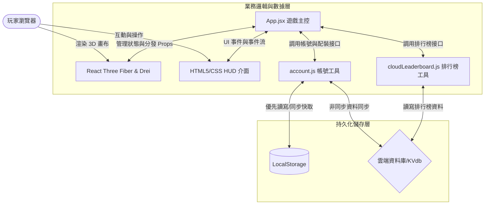
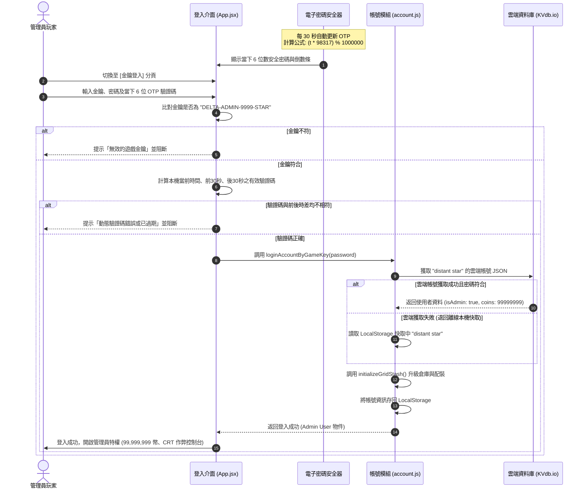
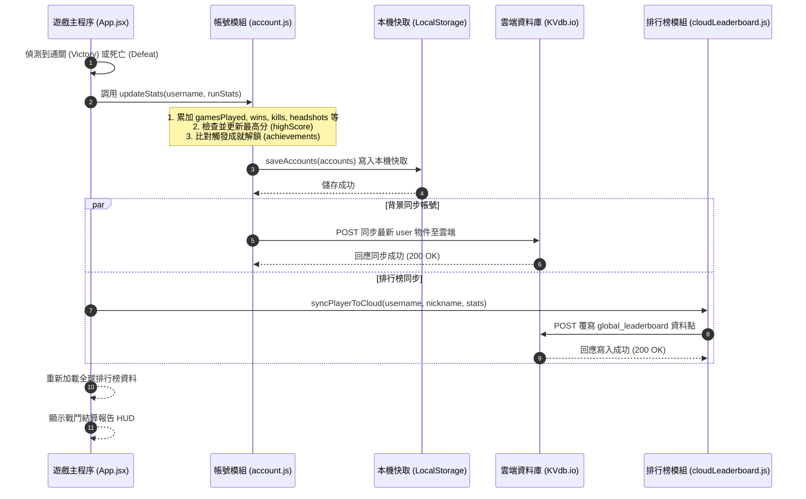
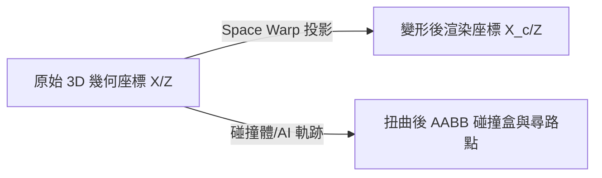

# 🛠️ DELTA FORCE: 3D 戰術訓練基地 - 軟體技術規格書與架構設計文件

本文件為 **Delta Force: 3D 戰術訓練基地 (Delta Force: 3D Tactical Training Outpost)** 專案的權威技術規格書。旨在記錄專案的系統架構、核心技術模組、底層物理與 AI 演算法，並提供完整的歷史 Bug 除錯防範檢修清單（Checklist），為後續的系統擴展與重構奠定根基。

---

## 1. 專案概述與定位 (Project Overview)

### 1.1 遊戲背景與目標
本專案是一款基於現代網頁技術開發的 **3D 第一人稱戰術射擊（FPS）防守與物資搜刮網頁遊戲**。核心玩法融合了：
- **動態波次防守與撤離**（Wave Defense & Extraction）。
- **格狀物品倉庫管理**（類似《逃離塔科夫》的 Grid Stash）。
- **改裝槍械系統**（Gunsmith Attachment System）。
- **地下通道「8 號出口」特殊玩法與隨機事件**。

### 1.2 多端與效能適配
- **桌上型電腦 (PC) 端**：支援滑鼠與鍵盤操作，並引入 **Pointer Lock API** 實現無邊界視角控制。
- **行動 (Mobile) 端**：針對手機與平板電腦橫屏（Landscape）適配，設計雙虛擬搖桿與按鈕容器，並優化了視窗防縮放（Viewport restriction）與雙指手勢阻截。
- **渲染效能**：透過 React 19 與 React Three Fiber (R3F) 將 3D 畫布與 HTML HUD 完全解耦，在主流瀏覽器均能維持 60 FPS 的渲染效能。

---

## 2. 系統架構設計 (System Architecture)

### 2.1 系統技術棧 (Technology Stack)
- **核心框架**：React 19.0.0
- **3D 渲染**：Three.js + React Three Fiber (R3F) + @react-three/drei
- **UI 與風格化**：HTML5 + Vanilla CSS3 (採用戰術綠發光 CRT 濾鏡風格)
- **持久化儲存**：LocalStorage（本機儲存） + KVdb / Firebase / Supabase（雲端儲存）
- **建置工具**：Vite + ESLint

### 2.2 前後端與資料庫互動架構
本專案採用無伺服器（Serverless）前端架構，透過 HTTP REST 接口直接與雲端儲存服務（預設為 KVdb.io）進行資料的寫入與讀取。



---

### 2.3 系統循序圖 (Sequence Diagrams)

#### 2.3.1 管理員 2FA 驗證與登入流程圖
管理員帳號（`distant star`）不允許常規密碼登入，必須使用獨特的 **KEY 登入渠道** 並通過雙重驗證。



#### 2.3.2 局後戰績結算與雲端同步流程圖
當一場戰局結束（勝利撤離或戰死），系統會即時更新本機快取，並向雲端傳送最新戰績。



---

## 3. 核心子系統與底層演算法 (Core Subsystems & Algorithms)

### 3.1 3D 視角控制與 AABB 滑動碰撞系統

#### 3.1.1 視角鎖定
PC 端透過 `PointerLockControls` 元件與瀏覽器本身的 **Pointer Lock API** 連動。
當玩家點擊遊戲畫面時，指針被隱藏且被鎖定在畫布中心，滑鼠移動的 $X$ 與 $Y$ 位移（`movementX`/`movementY`）將被直接對映為相機的旋轉角偏量。

#### 3.1.2 2D AABB 滑動碰撞演算法 (Sliding Collision)
為了防止玩家和敵軍 AI 「穿透」場景中的防禦沙包、混凝土牆、貨櫃等障礙物，系統實作了**二維軸對齊包圍盒 (AABB)** 滑動碰撞演算法。
- **碰撞體靜態定義**：全場景的掩體座標與尺寸均定義在 `STATIC_COLLIDERS` 與地鐵專用的 `FACILITY_COLLIDERS` 陣列中。
- **分離軸碰撞檢測**：將玩家的位移拆分為獨立的 $X$ 軸與 $Z$ 軸移動。每次移動後，將玩家的圓形包圍半徑 ($r = 0.45$) 與碰撞盒進行相交測試：
  $$\text{Overlap}_x = \neg (C_x + W_x \le O_x \lor O_x + O_w \le C_x)$$
  $$\text{Overlap}_z = \neg (C_z + H_z \le O_z \lor O_z + O_h \le C_z)$$
- **邊緣推回**：一旦偵測到重疊（Overlap），系統會即時將玩家推回最近的碰撞體外緣，保留另一個軸向的運動速度，從而實現貼牆狂奔時流暢的「滑行」效果。

---

### 3.2 空間扭曲與座標投影幾何演算法 (Space Warp Geometry)
在「地下地鐵長廊」地圖中，若觸發「空間扭曲 (Space Warp)」隨機事件，系統會使用一組非線性數學投影公式，將筆直的長廊渲染為 S 型的正弦波彎曲長廊。



#### 3.2.1 座標非線性投影公式
對於長廊上任意一個組件或實體（如牆面、日光燈、販賣機、玩家、敵軍），依據其 $Z$ 軸深度，計算其 $X$ 軸中心點偏移量 $x_c$ 與繞 $Y$ 軸正切旋轉角 $\theta_y$：

$$x_c = \sin(z \times 0.04) \times 6.0$$

$$\theta_y = \arctan(0.24 \cos(z \times 0.04))$$

#### 3.2.2 物理與碰撞體同步
不僅是視覺 3D 網格需要依照上述公式在頂點著色器/網格轉換中變形，所有的 AABB 碰撞盒陣列（`STATIC_COLLIDERS`）與 AI 行動路徑點，在每一幀更新時，都會動態映射至新的扭曲座標。這確保了玩家與 AI 在彎曲長廊內開火、移動時，碰撞體與視覺模型完全對齊，絕無穿透或懸空問題。

---

### 3.3 AI 多目標決策與防卡死機制

#### 3.3.1 AI 視線射線檢查 (Line of Sight Raycast)
為防止敵軍穿透貨櫃或沙包擊中玩家，AI 在開火前會使用 `THREE.Raycaster` 進行視線檢查：
- 射線起點為 AI 的頭部位置 `(enemy.pos.x, enemy.pos.y + 1.6, enemy.pos.z)`。
- 射線方向指向玩家的相機位置。
- 如果射線與場景中任何靜態掩體的相交距離小於與玩家的距離，則判定視線被遮擋（LoS blocked），AI 將無法對玩家造成傷害。

#### 3.3.2 地面 AI 撞牆防卡死機制
在 `Enemy` 元件的 `useFrame` 更新中，系統會實時監控 AI 的實際物理位移：
- **判定標準**：比對當下更新幀與上一幀的 $3D$ 距離。若 AI 處於移動狀態，但實際移動速度低於預期尋路速度的 $15\%$，則將其判定為碰壁或被阻礙卡死。
- **重劃路徑與狀態轉移**：若卡死計時累計達到 **$1.2$ 秒**，系統將強制觸發狀態轉移：
  - 放棄當前掩體，在全圖 `COVERS` 中隨機尋找一個新掩體。
  - 或者強制切換為向玩家「衝鋒」狀態。
  藉由轉向運動，引導 AI 智慧地繞過牆壁或障礙箱。

---

### 3.4 戰術配裝與格狀倉庫系統 (Grid Stash)

#### 3.4.1 倉庫網格資料結構 (Grid Stash Structure)
玩家的個人倉庫以 `gridStashItems` 陣列進行儲存。每個物品都是一個 JavaScript 物件，例如：
```javascript
{
  uid: "item_jjnlrxkuj",
  type: "ak47",
  r: 0,   // 起始行 (0-indexed Row)
  c: 2,   // 起始列 (0-indexed Column, 總共 10 列)
  rotated: false, // 是否旋轉 ( rotated 為 true 時，寬高對調)
  attachments: { sight: null, muzzle: null, grip: null, magazine: null } // 武器專屬配件插槽
}
```

#### 3.4.2 網格佔用計算與尋找空位 (findEmptySpace)
每個物品的類型均對應不同的網格尺寸（例如 AK47 佔 4x2、AWP 佔 5x2、醫療包與配件佔 1x1）。
在拖曳放置、黑市購買、或局外整理時，系統會調用 `findEmptySpace`，使用矩形重疊演算法（二維 Bounding Box 碰撞）遍歷 $10 \times 40$ 的倉庫網格，尋找第一個不與現有物件重疊的空餘座標 `(r, c)`。

#### 3.4.3 改裝槍械配件加成公式 (Gunsmith)
當玩家在倉庫中將配件拖曳至槍械上（或由主面板穿戴時），武器屬性會依據 `attachmentsConfig.js` 中的效果係數進行重算。改裝後的實際後座力與瞄準速度計算公式如下：

$$\text{後座力}_{\text{modified}} = \text{後座力}_{\text{base}} \times (1 - \sum \text{Muzzle}_{\text{recoilDec}}) \times (1 - \sum \text{Grip}_{\text{recoilDec}})$$

$$\text{開鏡時間}_{\text{modified}} = \text{開鏡時間}_{\text{base}} \times (1 - \sum \text{Sight}_{\text{adsSpeedInc}} - \sum \text{Grip}_{\text{adsSpeedInc}})$$

---

### 3.5 管理員 2FA 認證動態金鑰演算法

為了保證管理員特權帳號的安全性，本系統實作了一套基於時間序列的**確定性單向 OTP (One-Time Password) 演算法**：
- **步長（Step）**：每 30 秒為一個變動週期：
  $$t = \lfloor \text{Date.now()} / 30000 \rfloor$$
- **混淆乘數 (Secret Multiplier)**：$98317$ (大質數)。
- **計算公式**：
  $$\text{OTP} = (t \times 98317) \bmod 1000000$$
- **時差容錯度**：為防範客戶端與系統伺服器間的微小時間偏差，登入時會同時計算 $t-1$ (前 30 秒)、$t$ (當前 30 秒)、$t+1$ (後 30 秒) 的密碼值，只要三者之一匹配即可成功登入。

---

## 4. 回歸防範與除錯指南 (Regression Prevention Checklists)

每次對代碼進行調整、新功能開發或優化時，**必須**逐一測試並確認以下 $17$ 項歷史 Bug Checklist，防範舊錯誤重新出現（Regression）：

| # | Bug 名稱 | 症狀與原因 | 🛡️ 回歸防範測試 Checklist (必須通過) |
|---|---|---|---|
| **1** | **敵軍消失 Bug** | 敵軍出生後因 `meshRef` 初始化依賴 `null` 導致尋路 Effect 被跳過，集體移往 `(0,0,0)` 重疊。<br/>*修復：直接讀取 `data.position` 初始化尋路。* | [ ] 敵軍生成後是否正確朝向周邊沙包、貨櫃等掩體移動？<br/>[ ] 確認 AI 不會往地圖中心點 `(0, 0, 0)` 的木箱堆中集體堆疊？ |
| **2** | **隱形空氣牆 Bug** | 擴建地圖邊牆至 $\pm 120$ 米後，玩家在 $\pm 58$ 米處撞上隱形碰撞界限。<br/>*修復：同步 `PlayerController` 內部的 `mapLimit` 常數為 `118`。* | [ ] 玩家能一路奔跑到水泥圍牆邊緣（$\pm 118$ 米處）？<br/>[ ] 確認在 $\pm 58$ 米的半場處沒有任何空氣牆阻擋？ |
| **3** | **掩體無碰撞體積 Bug** | 玩家可以像幽靈一樣直接穿過碉堡沙包牆、中場集裝箱與補給站內部。<br/>*修復：加入 `STATIC_COLLIDERS` 陣列進行 X/Z 雙軸 AABB 碰撞檢測。* | [ ] 跑向碉堡沙包、中場集裝箱、混凝土牆、木箱時，確認會被正確擋住？<br/>[ ] 斜向貼牆奔跑時，是否能流暢地滑動前進，而不會卡住或發生劇烈抖動？ |
| **4** | **裝彈意外取消 Bug** | 按 R 裝彈時，換彈進度條閃現即逝，彈藥未能補滿。<br/>*修復：移除了 R 鍵事件監聽 Cleanup 內部的 `clearTimeout`，改為元件卸載時才做清除。* | [ ] 子彈消耗後按下 R 鍵，是否能顯示完整裝彈進度條並正確補滿彈藥？<br/>[ ] 裝彈中途切換主副武器，裝彈程序是否正確中斷且不會異常補滿彈藥？ |
| **5** | **手槍扣步槍子彈 Bug** | 切換到手槍後點擊開槍無反應，但會扣除步槍子彈。步槍子彈為 0 時手槍無法開火。<br/>*修復：在監聽中引入 React Refs（`setAmmoRef`、`enemiesRef` 等）緩衝，防止 `[]` 依賴項產生過期閉包。* | [ ] 切換到副武器 M9 手槍射擊時，右下角 HUD 的手槍彈藥量正確扣減，且主武器步槍彈藥量維持不變？<br/>[ ] 當主武器彈藥耗盡為 0 時，副手槍是否仍能正常開火與扣除子彈？ |
| **6** | **子彈穿透掩體 Bug** | 玩家躲在厚實沙包或集裝箱後，遠處敵軍發射的紅色雷射仍能穿透牆壁打中玩家扣血。<br/>*修復：AI 開火前引入 `THREE.Raycaster` 射線做視線阻擋檢測 (LoS Check)。* | [ ] 當玩家躲藏在集裝箱或碉堡沙包正後方時，遠處敵軍是否會停止朝玩家開槍？<br/>[ ] 確認此時畫面上不會有紅色雷射線穿過掩體？ |
| **7** | **行動端 HUD 遮擋 Bug** | 手機橫屏時，背包面板遮擋搖桿、底部狀態卡片重疊左右側按鍵、暫停鍵被任務欄遮蓋。<br/>*修復：CSS 媒體查詢重排版，背包左上、卡片寬度極限壓縮、暫停鍵移至雷達右側、按鍵上移 10px 防手勢遮擋。* | [ ] 行動端模擬器中，左下角虛擬搖桿周邊 150px 範圍內無任何背包面板遮擋？<br/>[ ] 底部血量、彈藥卡片收縮在中間空檔，不與左右操作鍵重疊？<br/>[ ] 右下按鍵與開火鍵是否完整顯示，沒有被系統底部導航橫條截斷？ |
| **8** | **行動端旋轉極慢 Bug** | 手機端滑動右側空白區旋轉鏡頭極為費勁，難以轉向。<br/>*修復：將行動端 touchmove 靈敏度 `sensitivity` 參數從 `0.0035` 提高至 `0.007`。* | [ ] 在行動端右側滑動手指，視角旋轉是否反應靈敏且流暢？ |
| **9** | **管理員權限硬編碼 Bug** | 註冊為 "distant star" 的使用者皆自動獲取管理員特權，且不刷新不重登不生效，亦不安全。<br/>*修復：移除代碼攔截，改在 KVdb 資料庫內寫入 `"isAdmin": true`。本機載入 `getAccounts` 時執行一次性遷移寫回 LocalStorage。* | [ ] 登入 "distant star" 帳號，檢查 LocalStorage 的 JSON 中是否確實包含 `"isAdmin": true` 屬性？<br/>[ ] 註冊其他隨機使用者，確認不會獲得管理員特權？ |
| **10** | **管理員 2FA 缺失 Bug** | 任何人均可直接利用一般登入框嘗試登入管理員帳號，存在密碼碰撞安全風險。<br/>*修復：常規登入框阻斷 `distant star`，要求切換至「金鑰登入 KEY」並驗證金鑰、密碼及確定性 OTP 驗證碼。* | [ ] 使用一般登入分頁登入 `distant star`，是否會被拒絕並引導提示切換？<br/>[ ] 在金鑰登入中，若金鑰、密碼、或動態驗證碼任一不符，是否均能正確阻擋登入並拋出錯誤？ |
| **11** | **敵軍 AI 卡牆 Bug** | 地面 AI 衝鋒或找掩體時，常卡在木箱或防護沙包前推牆且永遠卡死在原地。<br/>*修復：在 `Enemy` 中加入物理位移位差監控，卡牆 1.2 秒以上強制為其重規劃尋路，轉移狀態。* | [ ] 敵軍在衝向玩家或尋找掩體途中被沙包或牆壁擋住時，是否能在 1.5 秒內自動轉向繞開？ |
| **12** | **暫停重置狀態 Bug** | 在地下通道中點擊暫停，按下繼續後，玩家的 3D 座標與通關進度被重置回起點。<br/>*修復：優化 Canvas 重組時的 state persistence 狀態保持邏輯。* | [ ] 在通道中肅清一波敵人並推進至「出口 7」，按下暫停鍵，再點選繼續返回，玩家是否仍在原地？出口數字是否正確維持在 7？ |
| **13** | **地鐵飾物無碰撞 Bug** | 地鐵中的自動販賣機、垃圾桶、軍事掩體箱無碰撞，且在空間扭曲變彎時，碰撞體與視覺脫節。<br/>*修復：定義 `FACILITY_COLLIDERS`，並在空間扭曲時同步套用 Sine 變形公式重定位碰撞體。* | [ ] 走近地鐵長廊的自動販賣機與垃圾桶，是否能被正確擋住？<br/>[ ] 當「空間扭曲」事件啟動，走向已彎曲移位的自動販賣機，碰撞邊界是否與彎曲視覺模型一致？ |
| **14** | **跳關留在原地 Bug** | 管理員點選「跳過當前波次」或按 `O` 鍵後，依然留在起點，需跑完 240 米長廊才能進下一區。<br/>*修復：在跳波次邏輯中，若地圖為 `facility`，自動將玩家的 $Z$ 軸傳送至長廊盡頭 `z = -105` 米處。* | [ ] 在地鐵通道中按 `O` 鍵或控制台跳過波次，玩家相機是否自動被瞬間傳送至盡頭走廊前？ |
| **15** | **倉庫圖片尺寸 Bug** | 倉庫中物品圖片帶有黑色/不透明背景，且在拖曳至裝備格時，圖片尺寸未能按比例貼合網格。<br/>*修復：將物品圖片透明去背，優化 `.stash-item` CSS，使其高寬 100% 拉伸填滿格數單元。* | [ ] 進入大廳，觀察 AK47（佔 4x2 網格）與醫療包（1x1 網格）是否去背且整齊貼合網格？ |
| **16** | **首頁載入黑屏 Bug** | 首頁剛點開就呈現全黑，控制台報錯 `ReferenceError: selectedMap is not defined`。<br/>*修復：將 Weapon 元件內缺失 Props 的手電筒相關 Ref 提升至 `App` 層級統一分發。* | [ ] 刷新網頁，確認首頁能正常加載 CRT 掃描線背景與大廳，控制台無 `ReferenceError: selectedMap is not defined` 報錯？ |
| **17** | **敵軍 activeColliders 崩潰** | 進入實戰後畫面卡死，主控台頻繁報錯 `ReferenceError: activeColliders is not defined`。<br/>*修復：在 `Enemy` 元件的 `useFrame` 回呼中動態定義與 Warp 映射 `activeColliders`。* | [ ] 部署關卡後，敵軍是否能正常前進與衝鋒？控制台無 any `activeColliders` 未定義之崩潰報錯？ |

---

## 5. 開發建置與部署流程 (Deployment & Build)

### 5.1 本地開發
於專案根目錄中，執行以下指令以啟動 Vite 開發伺服器（預設連接埠為 `5173`）：
```bash
npm run dev
```

### 5.2 生產環境編譯
執行以下指令將代碼進行壓縮、混淆，並打包至 `dist` 目錄下：
```bash
npm run build
```

### 5.3 打包後預覽
在本地啟動一個靜態網頁伺服器，用以預覽打包後的生產版本網頁是否正常工作：
```bash
npm run preview
```
